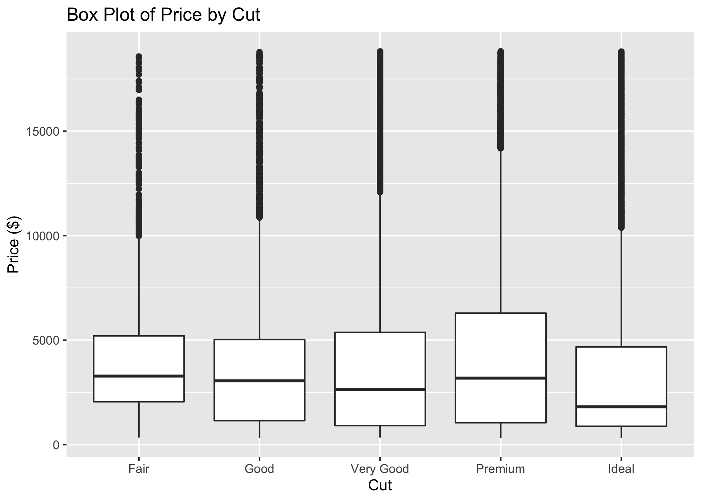

<style type="text/css">
  body{
  font-size: 14pt;
}
</style>

```{r setup, include=FALSE}
knitr::opts_chunk$set(echo = TRUE)
```

# Git

Git is going to be an important part of this course, and possibly your future! While it may be intimidating at first, your effort will be well worth it in the long run.
Git was already discussed in some detail in the first lecture, so we won't cover it much now. 
Instead, we will review some of the basic ideas and can provide help where needed. 

## Resources

* [Beginning Git and GitHub](https://search.lib.umich.edu/catalog/record/99187305231206381) by
Mariot Tsitoara.
* [Pro Git](https://git-scm.com/book/en/v2), free textbook by the maintainer of the Git homepage. 
* Your GSIs! 

## Basic Concepts

* **repository**: A representation of the current state of a collection of files, along with its entire history of modifications. 
* **commit** (noun): A recorded change made to the repository. 
* **branch**: While we won't do a lot with branches in this course, they are a very useful way of collaborating. Branches are essentially additional versions of the repository that you can create, name, delete, and merge into the main (or master) branch of the repository. 

## Common Git commands

Git is a powerful version control system that allows us to share and edit code, as well as keep track of previous versions of code. 

To get a "local" copy of a repository, you can use: 

```{bash gitClone, eval=FALSE}
git clone <repository>
```

For example, if you want to get the course repository on your personal computer, you may run: 

```{bash gitCloneEx, eval=FALSE}
git clone https://github.com/jravi123/datasci306-fall24
```

After you've copied a remote repository to your computer (cloned it), updates might be made to the 'remote' version. These changes could be made by you or someone else, such as me adding new lectures.

To update your local copy with these changes, run the following command:

```{bash gitPull, eval=FALSE}
git pull
```

You can also check the status of the local repository by running: 

```{bash gitStatus, eval=FALSE}
git status
```

This is a very useful command as it provides you with a basic summary about the status of a repository, for example, if any local changes have been made.

Other useful `git` functions include: 

* `git pull`
* `git add <filename>`
* `git commit -m "Commit Message"`
* `git push`

## Let us get posit cloud with our class repo

* Navigate to https://posit.cloud/ - sign in with umich ID.
* On the left tab `spaces` select `Your workspace`. Then from the right `New Project` dropdown button, select `New Project from Git Repository`. 
* Put `https://github.com/jravi123/datasci306-fall24` as the value for the text input box for `URL of your New Repository`. 
* Press `OK` to complete the remote repository to your workspace.


# Introduction to R

## R Packages

- Use the install.packages("<PACKAGE NAME>") command to install packages in R
- To load a package (already installed) use the library(<PACKAGE NAME>) command

```{r package1}
# run the first two lines if you have not installed the tidyverse and learnr packages
# install.packages("tidyverse")
# install.packages("learnr") 
library(learnr)            
library(tidyverse)            
```
- You can load lots of packages together as library(<PACKAGE1>, <PACKAGE2>, <PACKAGE3>)

```{r package2}
library(learnr, tidyverse)
```

## Assignment and Operations

- The standard form of an assignment is <OBJECT_NAME> <- <OBJECT_VALUE>
- The form <OBJECT_NAME> = <OBJECT_VALUE> also works, but R's community prefers <- notation
- A name can contain letters, numbers, underscores, and dots but should start with a letter

```{r assignment}
#variable assignments
u <- 3              ## this is considered standard
v = -2              ## this is accepted
x <- 6
y <- 'hello world'  ## 'hello world' is a string
y <- "hello world"  ## also double quotes
z <- TRUE           ## boolean variable (also T/F can be used for TRUE/FALSE but not True/False) 

#Few examples of operation
u + x
x/v
```

Exercise 1:

- add x and y
- add x and z

What do you observe?

```{r exercise1, exercise = TRUE}
x <- 6
y <- "hello world"  ## also double quotes
z <- TRUE    

# your code here
```

## Coding Style

Good coding style is like correct punctuation: you can manage without it, but it sure makes things easier to read. 

(picked this statement from: https://style.tidyverse.org/index.html)

Please try to follow the recommended coding style right from get go!


## Function Calls

We can use '?' to look up documentation of functions

```{r lookup, exercise = TRUE}
?sqrt 
sqrt(5)
```

```{r log}
log(100)  # natural log
log(100, base = 10) # log with base 10
```

```{r round}
round(3.1415926535, 3)
abs(-4)
```

You can also write your own functions:

```{r newfunc}
# writing your own functions
pow <- function(base, exponent) {
  # this is a trivial example
  return (base^exponent)
}

dog <- function() {
  print("woof") # does not need to return anything
}
```

```{r runfunc}
pow(2,3); dog()
```

Exercise 2: write a function to print the volume of a cylinder of radius $r$ cm, and height $h$ cm. $h$ and $r$ are the inputs of the function. Also print the volume of a cylinder with $r=3$ and $h=5$

*Hint: volume=$\pi r^2 h$*

```{r exercise2, exercise = TRUE}
## your code here.
```


## Vectors and Lists

Vectors (a.k.a atomic vectors) and Lists are fundamental building blocks in R.

- Vector is the basic data structure in R. A vector contain elements of a single data type (numeric, character, logical, etc.)
- Lists: elements of Lists can be another vector or any other type - i.e.,  can be heterogeneous

```{r atomicvec}
int_vec <- c(2L, 3L, 5L, 8L) # Make a vector containing integers
fp_vec <- c(-0.3, 16.7, 58.9) # Make a vector containing floating point numbers
string_vec <- c("apple", "banana", "cherry") # Make a vector containing strings
logical_vec <- c(TRUE, FALSE, TRUE) # Make a vector containing logical values

# Describe the structures of the vectors
str(int_vec)
str(fp_vec)
str(string_vec)
str(logical_vec)
```

We can also make a list of vectors of different types:
```{r list}
my_list <- list(int_vec, fp_vec, string_vec, logical_vec) # Make a list
str(my_list) # Describe the structure of the list
```

We can name the components of a vector or a list.
```{r vecname}
# Components can be named
named_string_vec <- c(fruit1 = "apple", fruit2 = "banana", fruit3 = "cherry")
named_list <- list(the_int_vec = int_vec, the_string_vec = named_string_vec)
```

```{r output-vec}
named_string_vec
```

```{r output-list2}
named_list
```

### Subsetting

- Subsetting refers to extracting parts of an object
- Several ways to subset a vector
  + [] usually used on vectors
     + Can extract multiple components
  + [[]] usually used on lists
     + Can only extract one component
  + $ used on lists
     + Can only extract one component, by name
     
```{r extrac}
string_vec[2] # Extract second component
string_vec[c(2, 3)] # Extract second and third components - note the use of c()!
c(2, 3)
string_vec[-1] # Extract all but the first component
string_vec[-c(1, 3)] # Extract all but the first and third components
string_vec[4]
string_vec[-4]

```

```{r extract2}
my_list[[1]] # Extract first component
named_list$the_int_vec # Extract component named "the_int_vec"
str(my_list[1]) # if you use [] on a list, the result is a sub-list
```

## Logical Operators
- Negation:
```{r negation}
a = TRUE
b = c(TRUE, FALSE)

!a      ## use '!' for negation (not) in R
!b
```

- Comparison:
```{r comparison}
x = c(1, 3, 5)
y = c(2, 3, 4)

x == y   ## element-wise equality
x != y   ## what does this do?
x > y    ## greater than
x >= y   ## greater than or equal to
```

- 'and' and 'or'

```{r and-or}
(5 > 2) | (1 == 0) 
(5 > 2) & (1 == 0) 

c = c(TRUE, TRUE, FALSE)
d = c(TRUE, FALSE, FALSE)
c & d
c | d

all(c(TRUE, TRUE, TRUE))
all(c(TRUE, TRUE, FALSE))

any(c(FALSE, FALSE, FALSE))
any(c(FALSE, FALSE, TRUE))
```

Useful: More about base R can be found here: [base R cheat sheet](https://github.com/rstudio/cheatsheets/blob/main/base-r.pdf)


## Working with Data

### Creating a Tibble

Tibble construction syntax is as follows:

```
dataframe = tibble(
  col_name1 = c(some_vector),
  col_name2 = c(some other vector)
)
```

We can construct a tibble:
```{r tibble}
# (These are characters from Avatar: the Last Airbender)
dat = tibble(
  name = c('Aang', 'Katara', 'Sokka', 'Toph', 'Zuko'), 
  age = c(112, 14, 15, 12, 16), 
  is_bender = c(T, T, F, T, T),
  nationality = c("Air", "Water", "Water", "Earth", "Fire"),
  grade = c(89, 94, 96, 86, 82),
  extra_credit = rep(1, 5) 
)

dat
```

We can extract elements from a tibble:
```{r tibble-extract}
dat[2,] # accessing a row
dat[4, 4] #accessing a single value
# syntax is: [row, column]
dat[, 5]
dat[2:3, c(1, 3, 4)]
```

We can also use $ to access a single column:
```{r dollarsign}
dat$name # accessing a single column
dat$grade
```

We can also create a new column:

```{r newcolumn}
dat$final_score = dat$grade + dat$extra_credit
print(dat)
# a dataframe (tibble) is a list of vectors (of the same length)
```

Logical operations on tibbles:
```{r tibblelogic}
subset(dat, age < 100) # subset based on logical condition
```

Exercise 3: Take a subset of Avatar characters who are benders and have a raw grade greater than 90%. Save this to a variable called `dat2`.

```{r exercise3, exercise = TRUE}
dat = tibble(
  name = c('Aang', 'Katara', 'Sokka', 'Toph', 'Zuko'), 
  age = c(112, 14, 15, 12, 16), 
  is_bender = c(T, T, F, T, T),
  nationality = c("Air", "Water", "Water", "Earth", "Fire"),
  grade = c(89, 94, 96, 86, 82),
  extra_credit = rep(1, 5) 
)

# Your code here

```

### A Large Dataset

`diamonds` is a dataset in package ggplot2:

```{r diamond}
head(diamonds)
dim(diamonds)
summary(diamonds)
```

You can use `?diamonds` to check the meaning of each variables.

## Plotting with ggplot2

Every ggplot2 plot has three key components:

- data

- A set of aesthetic mappings between variables in the data and visual properties, and

- At least one layer which describes how to render each observation. Layers are usually created with a geom function.

(Source: https://ggplot2-book.org/getting-started.html)

ggplot is a layer-based function. We first create a coordinate system that you can add layers to using the function ggplot(data = ...). This will create an empty graph.

```{r step1}
ggplot(data = diamonds)
```

We then add the data points onto this empty graph using the function `geom_point()`. The argument `mapping = aes(x = carat, y = price)` tells R what variables (columns in diamonds) we want to plot on each axis.

```{r step2}
ggplot(data = diamonds) + 
    geom_point(mapping = aes(x = carat, y = price))
```

It would be helpful to also visualize the color of diamonds in the scatter plot. We can study this more in depth by making a third variable and map to some aesthetic (i.e., visual property) of the points. Some examples are color, shape, size, and transparency.

```{r step3}
ggplot(data = diamonds) + 
    # carat on x-axis, price on y-axis, color represents different colors of the diamonds
    # alpha is the transparency of the points
    geom_point(mapping = aes(x = carat, y = price, color = color), alpha = 0.7)
```

Then we can add axes labels and title 

```{r step4}
ggplot(data = diamonds) + 
    geom_point(mapping = aes(x = carat, y = price, color = color), alpha = 0.7) +
    # specify axis labels
    labs(x = 'Carats', y = 'Price($)', title = 'Diamond price by carat count') 
```

You can get a better background by changing the theme. You can find more information about ggplot [here](https://ggplot2.tidyverse.org/reference/ggtheme.html).

```{r step5}
ggplot(data = diamonds) + 
    geom_point(mapping = aes(x = carat, y = price, color = color), alpha=0.7) +
    # specify axis labels
    labs(x = 'Carats', y = 'Price($)') + 

    # another way of specifying title
    ggtitle('Diamond price by carat count') +
  theme_bw()
```

You can also create subplots for different cut types by using `facet_wrap()`:

```{r facet}
ggplot(data = diamonds) + 
    geom_point(mapping = aes(x = carat, y = price, color = color), alpha = 0.7) +
    facet_wrap(~cut, ncol = 3) +
    labs(x = 'Carats', y = 'Price($)') + 
    ggtitle('Diamond price by carat count') +
  theme_bw()
```

Exercise 4: Recreate the box-plot below 

*hint you need to use `geom_boxplot`*



```{r exercise4, exercise = TRUE}
# your code here

```
