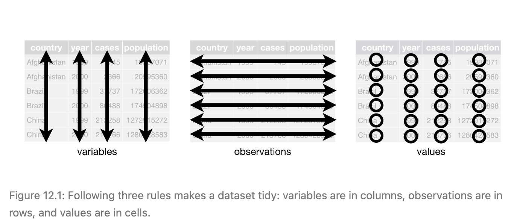

## Set up

```{r installPackages, echo=FALSE, include=FALSE, message=FALSE}
# This just checks if students need to install some packages that they might 
# not have.

if (!require(nycflights13)) install.packages("nycflights13", repos = "http://cran.us.r-project.org")
```

```{r setup, eval=TRUE, include=FALSE, message=FALSE, echo=FALSE}
library(learnr)     # For interactive exercises
library(tidyverse)  # For ggplot2, dplyr, readr
library(nycflights13)
library(maps)

tutorial_options(exercise.reveal_solution=T)
```

```{r fake_setup, echo=TRUE, eval=FALSE}
library(learnr)     # For interactive exercises
library(tidyverse)  # For ggplot2, dplyr, readr
library(nycflights13)
```


## Today's Content


- Pivoting   
- Relational Data

## Pivoting

We often work with data that are "tidy", meaning that each row corresponds to an observation, each column corresponds to a variable, and each cell has a single value. (See the picture below)

<center>

{width=100%}

</center>

A common problem is a dataset where some of the column names are not names of variables, but *values* of a variable. 
For example, let's consider the `table4a` dataset, which contains the number of Tuberculosis cases for 3 different countries: 

```{r}
table4a
```

Here we notice that there are two columns, `1999` and `2000`, that aren't variables but instead are values of a particular variable. 
We can fix this using the `pivot_longer` function. 

`pivot_longer`: this function "lengthens" data, increasing the number of rows and decreasing the number of columns.
For more detailed examples and exercises, I recommend looking at `vignette("pivot")`. For now, here are the most important arguments for this function: 

* `data`: The dataset we want to *pivot* longer.
* `cols`: The columns that need to be pivoted. This can be given as a vector of strings, or we could use any type of function we would select columns with using the `select` function. 
* `names_to`: The name of the column that will store the long variable names.  
* `values_to`: The name of the column that will store the values.

Here's what it would look like for the `table4a` dataset: 

```{r table4a, exercise = TRUE}
table4a |>
  pivot_longer(
    cols = -country, # Get everything except first column,
    names_to = "year",
    values_to = "TB_count"
  ) |> 
  mutate(year = as.integer(year))
```

`pivot_longer` is often useful for plotting with `ggplot`, because it allows us to use colors and facets based on the created variables. 
For example, you could color `TB_count` by `year` now that we have made the data "longer". 

Sometimes we can see the opposite problem: a single observation is scattered across multiple rows. To fix this issue, we would use the `pivot_wider` function. 
This issue is not as common, so we won't go into much detail on this for now. 

*Pivoting* (both longer and wider) can be a tricky idea, and it can take some practice to fully understand how to use these really powerful functions correctly. 
For more resources, we strongly recommend looking at `vignette("pivot")`. 


## Duplicate Keys

### One table has duplicate keys.

This is useful when you want to add in additional information as there is typically a one-to-many relationship.

{width=90%}
```{r one-to-many}
x <- tribble(
  ~key, ~val_x,
     1, "x1",
     2, "x2",
     2, "x3",
     1, "x4"
)

y <- tribble(
  ~key, ~val_y,
     1, "y1",
     2, "y2"
)

left_join(x, y, by="key")
```


### Both tables have duplicate keys.

This represents a many-to-many join and is usually an error since they key does not uniquely identify observations in either table. Joining duplicated keys results in the Cartesian product of all the possible matches.

{width=90%}

```{r}
x <- tribble(
  ~key, ~val_x,
     1, "x1",
     2, "x2",
     2, "x3",
     3, "x4"
)
y <- tribble(
  ~key, ~val_y,
     1, "y1",
     2, "y2",
     2, "y3",
     3, "y4"
)

left_join(x, y, by = "key")
```


## Defining the Key Columns

When we do a join using `left_join`, R takes as the key whatever column names the two tables have in common. 

### Default 

The defaul with no `by` specified uses all variables that appear in both tables, the so-called natural join. For example, the `flights2` and `weather` tables match on their common variables: year, month, day, hour, and origin.

```{r flights2}
flights2 <- flights %>% 
  select(year:day, hour, origin, dest, tailnum, carrier)
```


```{r}
names(flights2)
names(weather)
```

The `flights2` and `weather` tables match on their common variables: year, month, day, hour and origin.

```{r}
flights2 %>% 
  left_join(weather)
```

We can check the two tables separately:
```{r}
flights2 %>% filter(year==2013, month==1, day==1, hour==5, origin=="EWR")
weather %>% filter(year==2013, month==1, day==1, hour==5, origin=="EWR")
```

### `by=c("a"="b")`

A named character vector: by = c("a" = "b"). This will match variable a in table x to variable b in table y. The variables from x will be used in the output. For example, if we want to draw a map we need to combine the flights data with the airports data which contains the location (lat and lon) of each airport. Each flight has an origin and destination airport, so we need to specify which one we want to join to:

```{r}
flights2 %>% 
  left_join(airports, c("dest" = "faa")) %>% head

flights2 %>% 
  left_join(airports, c("origin" = "faa")) %>% head
```


## Exercises

### Question 1

Using the two tables `flights` and `planes` to make a new table `age_delay` that contains the tail number of a plane, the number of flying records of a plane in `flights`, the age of a plane and its average arrival delays.

**Hints:** *in table flights, you can use group_by() and summarise() to get the average arrival delay for each plane, and in table plane, variable year tells you the year manufactured. Data in table flights are in 2013.*


```{r join1, exercise=TRUE}

```

```{r join1-hint}
age_delay <- left_join(...)
```


```{r join1-solution}
delay <- group_by(flights, tailnum) %>% summarise(avg_delay = mean(arr_delay, na.rm=TRUE), n = n()) 
age <- mutate(planes, age = 2013 - year) %>% select(tailnum, age)
age_delay <- left_join(age, delay, by="tailnum") 
```

```{r join1-sol-setup, eval=TRUE, echo=FALSE}
delay <- group_by(flights, tailnum) %>% summarise(avg_delay = mean(arr_delay, na.rm=TRUE), n = n()) 
age <- mutate(planes, age = 2013 - year) %>% select(tailnum, age)
age_delay <- left_join(age, delay, by="tailnum") 
```

### Question 2
Consider the planes with less than 50 flying records, and are less than 30 years old. Is there a relationship between the age of a plane and its delays? Draw a scatter plot and a smooth line to answer this question.

```{r join2, exercise=TRUE, exercise.setup="join1-sol-setup"}

```

```{r join2-hint}
age_delay %>% filter(...)
```

```{r join2-solution}
age_delay %>% filter(n > 50, age < 30) %>% 
  ggplot(aes(x = age, y = avg_delay))+
  geom_point()+
  geom_smooth()
```


## Filtering Joins

### Semi-join

`semi_join(x, y)` keeps all the observations in `x` that are also in `y`.

{width=90%}


**Exercise**: Filter flights to only show flights with planes that have flown at least 100 flights.

```{r semijoin, exercise=TRUE}

```

```{r semijoin-hint}
#You can use function count() to count the unique vlues of one or more variables.
?count
```

```{r semijoin-solution}
planes_many <- flights %>% 
  count(tailnum, sort=TRUE) %>% 
  filter(n > 100)

semi_join(flights, planes_many)
```

### Anti-join

The opposite of a semi-join is an anti-join: keeps all the observations in `x` that are not in `y`.

{width=90%}


**Exercise**: Check the variable `carrier` in `flights`, what do the tail numbers that don’t have a matching record in planes have in common? Show the number of tailnumbers that don’t have a matching record in planes for each carrier.

```{r antijoin, exercise=TRUE}

```

```{r antijoin-hint}
flights %>% anti_join(...) 
# You can use function count()
```

```{r antijoin-solution}
flights %>% 
  anti_join(planes, by="tailnum") %>% 
  count(carrier, sort = TRUE)
```


## Exercises

Compute the average arrival delay by destination, then join on the airports data frame so you can show the spatial distribution of arrival delays. Visualize the delays on a map of the United States.

**Hints**: *You can use semi-join() to filter the flights that have 
destinations in the table airports, and then calculate the average arrival delays for 
each destination*

```{r delaymap, exercise=TRUE}

```

```{r delaymap-hint}
# An easy way to draw a map of the United States:
ggplot(..., aes(lon, lat)) +
  borders("state") +
  coord_quickmap() + ...

```

```{r delaymap-solution}
flights %>% 
  semi_join(airports, c("dest" = "faa")) %>%
  group_by(dest) %>% 
  summarise(delay = mean(arr_delay, na.rm=TRUE)) %>% 
  left_join(airports, by = c("dest"="faa")) %>% 
  ggplot(aes(lon, lat)) +
  borders("state") +
  geom_point(aes(colour = delay)) +
  coord_quickmap()+
  scale_color_gradient2(low = "blue", high = "red")

```
