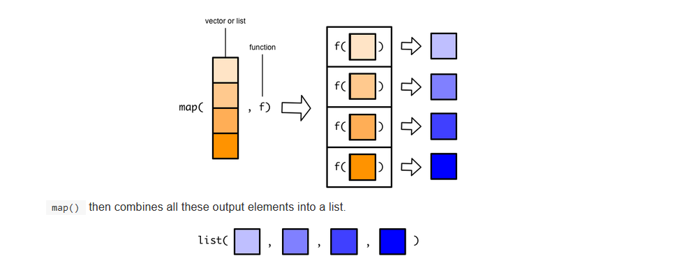
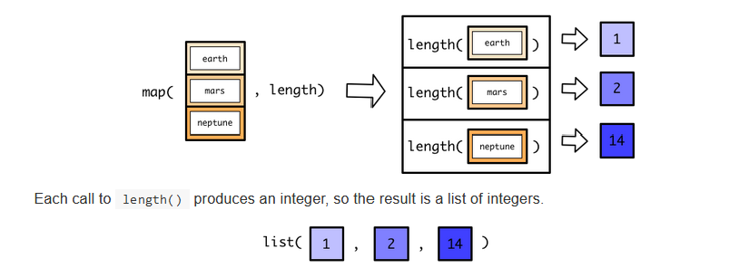
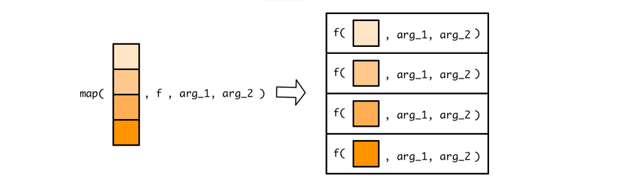
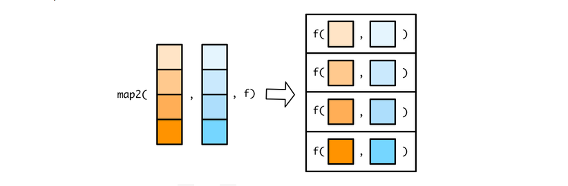
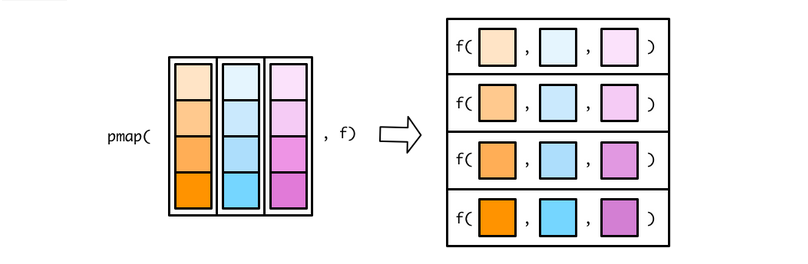

## Set up

```{r installPackages, echo=FALSE, include=FALSE, message=FALSE}
# This just checks if students need to install some packages that they might 
# not have.

if (!packageVersion("learnr") == "0.11.1") 
  install.packages("learnr", repos = "http://cran.us.r-project.org")
# For HW4 Q2, Q3
if (!require(Lahman)) 
  install.packages("Lahman", repos = "http://cran.us.r-project.org")

if (!require(gapminder))
  install.packages("gapminder", repos = "http://cran.us.r-project.org")

```

```{r setup, eval=TRUE, include=TRUE, message=FALSE, echo=TRUE}
library(learnr)     # For interactive exercises
#library(tidyverse)  # For dplyr, purrr
library(purrr)
library(dplyr)
library(ggplot2)
library(gapminder)
```

```{r, include=FALSE, message=FALSE, echo=FALSE}
tutorial_options(exercise.reveal_solution=FALSE)
```


## Today's Content

- Iterations


## Loops

### Motivation
- Imagine you have dataset, `df` and would like to apply a transformation to each column before fitting a model to the data.

```{r dataset1, echo=FALSE}
df <- tibble(
  a = rnorm(10, 3, 3),
  b = rnorm(10, 8, 2),
  c = rnorm(10, 50, 10),
  d = rnorm(10, 75, 25)
)

## Make copies if raw tibble for future use
df5 <- df4 <- df3 <- df2 <-df1 <- df

print(df)
```


- Let's define our transformation by the min-max scaler:
$$
x_{scaled} = \dfrac{x - x_{min}}{x_{max} - x_{min}}
$$
**METHOD 1**        
- Apply same methodology to all columns of interest one at a time.
```{r scaler_m1}
df$a <- (df$a - min(df$a, na.rm = TRUE)) / 
  (max(df$a, na.rm = TRUE) - min(df$a, na.rm = TRUE))

df$b <- (df$b - min(df$b, na.rm = TRUE)) / 
  (max(df$b, na.rm = TRUE) - min(df$a, na.rm = TRUE))

df$c <- (df$c - min(df$c, na.rm = TRUE)) / 
  (max(df$c, na.rm = TRUE) - min(df$c, na.rm = TRUE))

df$d <- (df$d - min(df$d, na.rm = TRUE)) / 
  (max(df$d, na.rm = TRUE) - min(df$d, na.rm = TRUE))

print(df)
```

- Applying same methodology to different columns of the same type can be boring and time consuming.
- Can we do better?


**METHOD 2**     

- `functions` automate this reptitive task      
- We write a function and apply to all columns of interest
```{r scaler_m2a}
## min-max scaler function
min_max_scaler <- function(x) {
  rng <- range(x, na.rm = TRUE)
  (x - rng[1]) / (rng[2] - rng[1])
}
```

```{r scaler_m2b}
## apply to all columns
df1$a <- min_max_scaler(x = df1$a)
df1$b <- min_max_scaler(x = df1$b)
df1$c <- min_max_scaler(x = df1$c)
df1$d <- min_max_scaler(x = df1$d)
print(df1)
```

- If we had 25 columns in the tibble, would we have to write 25 lines of code to apply the function to all columns? What if we had 100, 1000, 10000? Could we further simplify our tasks?   
- We can use iterations!!!   
- Let's look at some iteration techniques.

## For Loops
Syntax:

    for (index in vector) {
       [do something for each index]
    }
  
We explore 3 forms of looping here:      

- **(1) Looping along the indices of a vector**      
```{r}
## Let's first look at how indices of a vector appear
for(i in 1:5) {
       print(i)
}
```


- **(2) Looping along the elements of a vector**   
```{r}
x <- c("a", "b", "c", "d")

for(i in x) {
     ## Print out each element of 'x'
     print(i)
} 
```


- **(3) Looping along the length a vector **   
```{r}
## Generate a sequence based on length of 'x'
for(i in seq_along(x)) {   
         print(x[i])
}
```


**EXERCISE 1**    
How would you use a `for` loop and our `min_max_scaler()` function to accomplish our transformation task?     
Please use the dataset `df3` 

```{r mx_scaler_for, exercise=TRUE}
## Your code here


```

```{r mx_scaler_for-hint}
# (1) what is the argument of the min_max_scaler function?
# (2) how do you update a column of a dataset?
```

```{r mx_scaler_for-solution}
## (1) Option 1
for (i in seq_along(df3)) {
   df3[i] <- min_max_scaler(df3[i])
}
print(df3)


## (2) Option 2
for (i in 1:ncol(df4)) {
   df4[i] <- min_max_scaler(df4[i])
}
print(df4)
```

## While Loops  

- Sometimes you don’t even know how long the input sequence should run for.   
- When this happens, we can use a special type of loop and iterate until a **$condition$** is met.    
- This is called a **while** loop.

Syntax:

     <OPTIONALLY INITIALIZING THE ITERATOR>
     while (<condition is true>) {
        [do something]

        <OPTIONALLY INCREMENTING THE ITERATOR>
     }


- **Question**:    
What do you think is happening here?
```{r}
# Initialize
count <- 0

while(count < 10) {
        print(count)
        count <- count + 1 ## increment/update iterator
}
```


**EXERCISE 2**  
**Monte Carlo Simulation**    

- Generate random numbers from $Normal(0, 1)$ and stop when you have more positive values than negatives. 
- Write a function that implements this algortihm and returns number of iterations. The Pseudo-code is given below:

          1. set positive_counter and negative_counter to 0
          2. Generate one sample y ~ Normal(0, 1) i.e rnorm(n = 1, mu = 0, sd = 1)
             2.1 if y > 0 then positive_counter increases by 1
             2.2 else negative_counter increases by 1
          3. Repeat step 2 until positive_counter > negative_counter


```{r monte_carlo, exercise=TRUE}
## Your code here

```


```{r monte_carlo-solution}
f <- function(){
    ## Initialize counts
    positive_counter = negative_counter = 0

    ## Since we don't know the condition would be met,
    ## i.e when positive_counter will be greater than negative_counter,
    ## we will use a while loop

    while(positive_counter <= negative_counter) {
        ## Generate one random normal sample while we do not meet the termination condition
        y = rnorm(n = 1, mean = 0, sd = 1)

        if(y > 0){

          ## we get one more postive value
          positive_counter = positive_counter + 1

        } else {
          
          ## we get one more negative value
          negative_counter = negative_counter + 1

        }
    }

    ## Goal is to return how many times run this iteration until condition was met
    ## note that this is outside the loop
    tot_iters = positive_counter + negative_counter
    return(tot_iters)
}

## now call the function
## since y is a random variable, this may change each time we call the function
## I'll call the function several times to demonstrate this
f()
f()
f()
f()
```


## The Map Family
- Looping can sometimes take up storage and may require initializing a vector.   
- Consider the exercise below:   

**Example**   

- Write a function that computes the number of unique values in each column of a dataset using iteration
- Implement this function on the `iris` dataset.

**Solution**
```{r}
uniq_length <-function(df){
  ## Get the number of columns in the tibble
  ## store in a placeholder
  out <- numeric(length = ncol(df))

  ## Now loop over each column and capture the number of unique values
  for (i in seq_along(df)) {
     uniq <- unique(df[[i]])
     out[i] <- length(uniq)
  }

  ## Map column names to the output vector for easier identification
  out <- setNames(nm = names(df), object = out)
  return(out)
}

uniq_length(df = iris)
```


- As these forms of iterations are not uncommon in our programming routines, we have yet a simpler approach to handling these using the `map()` family of functions from the `purrr` package.    


## Maps  

- The `map` functions are **functionals** (_a function that takes a function as an input and returns a vector as output_). 
- They take **lists** or **atomic vectors** and a **function** as arguments. A visualization of how they work is below:

{width=90%}


- Consider the list below.   
- We wish to take the length of every element of the parent list: 

```{r}
moons <-
  list(
    earth = 1737.1,
    mars = c(11.3, 6.2),
    neptune = 
      c(60.4, 81.4, 156, 174.8, 194, 34.8, 420, 2705.2, 340, 62, 44, 42, 40, 60)
  )
```

Using `map` this is evaluated as:

{width=90%}

```{r}
map(moons, length)
```

## Variants of Map
- From the previous example, we see that a list is returned as the output.   
- This is the default behavior of `map`. 
- However, we may want atomic vectors (***intergers, doubles, characters, logical***) to be the outputs for specific tasks.
- Below gives variations of the `map` functional together with descriptions:


- `map_int()` creates an integer vector.
- `map_dbl()` creates a double vector.
- `map_chr()` creates a character vector.
- `map_lgl()` creates a logical vector.
- `map_df()` creates a dataframe.

**Example**
```{r}
map_dbl(moons, median)
```

**Exercise**   

What `map_` variant would you use to complete the following tasks? Implement the codes.

1. Find the data type for each column of `mtcars`
2. Verify which columns of `nycflights13::flights` are numeric.
3. Compute the mean of all columns in `mtcars`
4. Find the length of unique values in all columns of `mtcars`.

```{r map_vars,  exercise=TRUE}
## Your code here
```

```{r map_vars-solution}
# (1) Character
map_chr(mtcars, typeof)

# (2) Integer
map_int(nycflights13::flights, is.numeric)

# (3) Double
map_dbl(mtcars, mean)

# (4) Integer
map_int(mtcars, function(x) length(unique(x)))
```


## Anonymous functions and shortcut   
**1. Anonymous functions**       

- As you may have observed from question 4 on the previous slide (***Find the length of unique values in all columns of `mtcars`***), we can parse user-defined functions to map if they don't exist.     
- In our `moon` data, the distance is measure in kilometers. Let us try to convert this from kilometers to miles by writing our own function:
$$
\operatorname{Mile} = \operatorname{Kilometer} \times 0.62
$$
```{r}
## Kilometers to miles
km_to_miles <- function(x) {
  x * 0.62
}

map(moons, km_to_miles)
```

- We do not need to name this function if we don't intend using it again.          
- Thus, we can parse the function "on-the-fly" when writing our map code.        
- A function without a name is called an `anonymous function`.       
- Let's accomplish same task using an anonymous function      
```{r}
## Using anonymous function
map(moons, function(x) x * 0.62)
```


**2. Shortcuts**  

- Even better, the `purrr` package makes parsing anonymous functions to `map` easier and neater.    
- Consider the code below that performs the same task as in the example above:
```{r}
## Using shortcuts
map(moons, ~ . * 0.62)
```

- How does it work?
{width=90%}

**3. Extra functional arguments**  

- Some functions accept extra arguements like `mean()` which has the extra argument `na.rm = TRUE` if you want to escape missing values.       
- Let's look at an exmaple below.       
- Before that, see how the visualization below explains this idea:
{width=90%}
**Example**

- Find the 95% percentile of `df`
```{r}
map_dbl(df, quantile, probs = 0.95, na.rm = TRUE)
```

**Exercise**  

- Now, revisiting the earlier example on why we need maps, use `map` and anonymous function to  compute the number of unique values in each column of the `iris` dataset

```{r map_iris, exercise=TRUE}
## Youir code here
```

```{r map_iris-solution}
map(iris, ~ length(unique(.)))
```


## Map with multiple inputs

- We have learned so far how to use `map_` to iterate over a single vector.      
- However, there is so much power with the `purrr` package such as parsing several vectors as arguments for a function to be applied in parallel (row-wise) to the elements of the dataset.  
- We will first look at `map2()` for two inputs and then `pmap()` (parallel map) for multiple inputs. Note that since this works in parallel, the input lengths of the vectors must be equal

**1. map2 (for two inputs)**
{width=90%}

**Example**  

- Find the row-wise minimum
```{r}
x <- c(1, 2, 4)
y <- c(6, 5, 3)

map2_dbl(x, y, min)
```

- Inside anonymous functions in the `map()` functions, you refer to each element of the input vector as `.` . In the `map2()` functions, you refer to elements of the first vector as `.x` and elements of the second as `.y`

**Exercise**    

- How would you divide x vector by y using `map2()`?

```{r map2, exercise=TRUE}
## Your code here

```

```{r map2-solution}
map2(x, y, ~.x/.y)
```


**2. pmap (for multiple inputs)**     

- Just as we have `map2` for two inputs, `pmap` (***parallel map***) take two or more inputs parsed as a list.    
- That is, in `pmap()` functions, you specify a single list that contains all the vectors (or lists) that you want to supply to your function.    
- Let us look at the  visual below for a demonstration of how this works:

{width=90%}

**Example**

- Find the row-wise minimum
```{r}
## Example

x <- c(1, 2, 4)
y <- c(6, 5, 3)
z <- c(100, 15, 1)

pmap_dbl(list(x, y, z), min)
```

- Alternatively, Tibbles are lists, so we could also combine x, y, and z into a tibble
```{r}
tibble(x, y, z) %>% 
  pmap_dbl(min)
```

- `pmap()` can involve any number of input vectors, so we need a new way of referring to each vector in an anonymous function.   
- Instead of using `.`, `.x`, or `.y`, use `..1.`, `..2`, `..3`, etc. to refer to the different vectors.

**Example**

- Compute the rowwise sum of `x, y, z`

```{r}
x <- c(1, 2, 4)
y <- c(6, 5, 3)
z <- c(100, 15, 1)

pmap_dbl(list(x, y, z), ~..1 + ..2 +..3)
```


## Putting it all together
**Inspecting our data (gapminder)**        

- Let us warm up for the more interesting exercise on the next slide.   
- Using the `gapminder` dataset, create a dataframe whose columns are 
   + `class` - the class of all columns
   + `n_distinct` - the number of distinct or unique value
   + `variable` - the variable whose values were computed in the two columns above.***[Hint:] `map_df()` has the `.id` argument which you might want to explore***
   
- Use `map_df`.
- Your output should look this:

|variable|n_distinct|class|
|:------:|:-------:|:---:|
|country |	142	| factor|		
|continent |	5	| factor	|	
|year   |	12	| integer|		
|lifeExp |	1626 |	numeric|		
|pop	| 1704	| integer|		
|gdpPercap|	1704 |	numeric|		


### Exercise 1
```{r Ex1, exercise=TRUE}
## Your code here
```


```{r Ex1-solution}
gapminder %>% map_df(~(data.frame(n_distinct = n_distinct(.x),
                                  class = class(.x))),
                     .id = "variable")

## Equivalently:
map_df(gapminder, ~(data.frame(n_distinct = n_distinct(.x),
                                  class = class(.x))),
                     .id = "variable")
```


### Exercise 2
**Creating a list of plots that compare life expectancy and GDP per capita for each continent/year combination**       

- Create a variable `continent_year` which stores all the distinct `continent` `year` pairs. Thus, this object has two columns: `continent` and `year`     
- From `continent_year`, create two objects `continents` and `years`. Be sure to convert `continents` to a `character` object.       
- Using `map2()` make a list of scatterplots for each continent/year combination from the `gapminder` data. Call this list object `plot_list`. Be sure to dynamically give each plot it's corresponding continent/year pair.    
- How many different plots are stored in `plot_list`? Verify this using `length(plot_list)`
- What continent/year plot is stored in list index 16? What about 31? Verify using `plot_list[[16]]`,
`plot_list[[31]]` ...

```{r Ex2, exercise=TRUE}
## Your code here
```

```{r Ex2-hint}
plot_list  <- map2(.x = object1, # the first object to iterate over
                   .y = object2, # the second object to iterate over
                   .f = plotFunction(.x, .y))
```

```{r Ex2-solution}
# 1.
continent_year <- gapminder %>% distinct(continent, year)

# 2.
continents <- continent_year %>%
               pull(continent) %>% 
               as.character
years     <- continent_year %>%
               pull(year)
# 3.
plot_list <- map2(.x = continents, 
                  .y = years, 
                  .f = ~{
                    gapminder %>% 
                      filter(continent == .x,
                             year == .y) %>%
                      ggplot() +
                      geom_point(aes(x = gdpPercap, y = lifeExp)) +
                      ggtitle(paste0(.x, " ", .y)) + 
                      theme_bw()
                  })

## length of list
length(plot_list)

## 
plot_list[[16]]
plot_list[[31]]
```


```{r}

#
```

