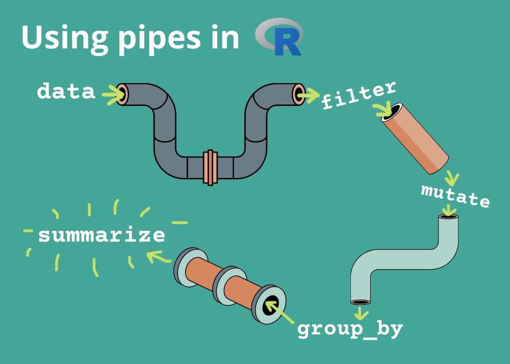

```{r setup, include=FALSE}
library(learnr)
library(tidyverse)
library(lubridate) # install.packages("lubridate") if you don't have this
```


## Tables: lists of vectors

Review:

* Samples: collections of $n$ units
* Variables: $k$ measurements common to all units
* Tables ($n \times k$): units on rows, variables on columns
* Conceptual table implementation: lists of length $k$ composed of vectors of length $n$

Example:
```{r}
x <- 1:5
y <- paste(100:109)
length(x)
length(y)
d <- list(column_x = x, column_y = y)
d
d$column_x
```

## Better tables: `data.frame` and `tibble`

A **list** does not enforce columns to be the same length. For structured data, a **data.frame** is preferred. However, **tibble**, is a version of data.frame, that is more efficient when working with tabular data.

```{r}
d2 <- as.data.frame(d)
dim(d2)
d3 <- as_tibble(d2)
d3
```

Note: Note how the lengths of the columns is made the same for both tibble an data.frame by repeating the elements

## Common operations on tables (overview)

* Pulling out a single column: `d$col`
* Creating a single column: `d$newcol <- EXPR`
* Selecting only required columns: `select(d, col1, col2)` (and several other forms)
* Filter out rows: `filter(d, criterion1, criterion2)`
* Creating new columns (in new table): `mutate(d, newcol = f(col1, col2), newcol2 = g(col3, newcol))`
* Sort rows: `arrange(d, col)`
* Remove duplicates: `distinct(d, col)`
* Get top values: `slice_max(d, col)`


## Revisiting the `pipe` operator




## Getting several columns at once

```{r}
select(d3, column_x) |> head(2)
```

## Getting all but some columns

```{r}
select(d3, !column_x) |> head(2)
```

Alternatively
```{r}
select(d3, -column_x) |> head(2)
```

## Selectively grabbing columns


```{r letters, exercise = TRUE}

```

```{r}
d3$letter <- letters[d3$column_x]
d3$LETTER <- LETTERS[27 - d3$column_x]
head(d3, 2)
```
Get only "character" type columns:
```{r}
select(d3, where(is.character)) |> head(2)
```

## 'is' and 'as' functions for columns

* `is.character`: strings/character vectors
* `is.numeric`: number/numeric
* `is.factor`: factor/categories
* `is.logical`: logical/boolean
* `is.double`, `is.integer`: decimal and integer numeric types, respectively

While the `is` prefix returns a boolean result based on if the passed in argument belongs to the suffix, the `as` prefix functions converts the given argument to the corresponding suffix class if only it is convertable, else 'NA' is returned

```{r}
as.numeric('10')
as.numeric('abc')
as.logical('F')
as.logical(1)
as.logical('a')
```

When we start to write our own functions, we'll be able to create many more

## Grabbing rows by index

Tables in R allow for **two-dimensional indexing**: `tbl[rows, cols]`.

```{r}
d3[1, ]
d3[2:4, ]
d3[, c("column_x", "LETTER")]
d3[1:3, c("letter", "LETTER")]
```

## Grabbing rows by criteria (old school)

```{r}
d3[d3$column_y > 105, ]
```

## Grabbing rows (new school)

```{r}
filter(d3, column_y > 105)
```

## Multiple criteria

```{r}
filter(d3, column_y > 105 & column_x < 9)

# preferred alternative

filter(d3, column_y > 105, column_x < 9)
```

```{r}
filter(d3, column_y > 108 | column_x < 3)
```

## Exercise

Combine `filter` and `select` to get only the columns `cty` , `hwy`, and `cyl` for cars that have more than 4 cylinders.

```{r}
head(mpg, 1)
```

```{r filter-select, exercise = TRUE}

```

## Tasks
* Creating new column (in new table): `mutate(d, newcol = f(col1, col2))`
* Grouping and summarizing `group_by(d, discrete_column) |> summarize(new_name = a_function(col))`

## Mutate: create columns

Before we had code like:
```{r eval = FALSE}
df$new_column <- f(df$x, df$y)
```

It would be convenient to avoid the repeated `df$` and also not tamper with the existing table but create a new one instead:
```{r eval = FALSE}
new_df <- mutate(df, new_column = f(x, y))
```

By default, `mutate`, returns a brand new table by adding the new column to df and existing df is not changed.

## Mutate creates new tables

```{r}
aatemp <- read_csv("data/ann_arbor_weather.csv.gz")
dim(aatemp)
head(aatemp)
aatemp2 <- mutate(aatemp, tdiff = TMAX-TMIN)
dim(aatemp)
dim(aatemp2)
select(aatemp2, tdiff, TMAX, TMIN)
```

## Mutate for multiple columns

```{r}
aatemp3 <- mutate(aatemp,
                  tdiff = c(NA, diff(TMAX)),
                  tdiff_abs = abs(tdiff))
```

What is _diff_ function do?

```{r}
?diff
```

## Mutate to remove columns

```{r}
# NB: reassigning to same variable name
aatemp3 <- mutate(aatemp3, tdiff = NULL)
colnames(aatemp3)
```

## Using helper functions

Recall a $Z$-score is defined by:
$$Z = \frac{X - \bar X}{\sigma}$$

```{r}
aatemp3 <- filter(aatemp3, !is.na(tdiff_abs))
aatemp3 <- mutate(aatemp3, 
                  z = (tdiff_abs - mean(tdiff_abs)) / sd(tdiff_abs))
ggplot(aatemp3, aes(x = z)) + geom_histogram()
```

## Conditional evaluation with `if_else`

We may want to create new values using a condition. The `if_else` function from `dplyr` (part of `tidyverse`) can help:
```{r}
if_else(c(TRUE, FALSE, FALSE), c("aT", "bT", "cT"), c("aF", "bF", "cF"))
```

If *TRUE* get from the value from the first vector, else get the value from the second vector

R will also "recycle" values, so we can pass in single value that will get repeated:
```{r}
x <- c(-2, 1.4, -0.25, 7)
if_else(x < 0, 0, x)
```


There is also `ifelse` from base R, which is similar, but a bit more permissive in what it allows for the two result vectors.

```{r if-else, exercise = T}

ifelse(c(TRUE, FALSE, FALSE), 'a', 0)

if_else(c(TRUE, FALSE, FALSE), 'a', 0)
```

Since `if_else` is more efficient also, we will use `if_else`

## Exercise

We often want to express variables on a different scale, such as constraining them to be between 0 and 1:
$$Y_i = \frac{X_i - \min(X)}{ \max(X) - \min(X)}$$

Use `mutate` to rescale `x` in this data: 
```{r rescale, exercise= TRUE}
d <- data.frame(x = rnorm(10))

```

```{r rescale-solution}
d <- data.frame(x = rnorm(10))
mutate(d, y_i = (x - min(x) / (max(x) - min(x))))

```

## Exercise

Use `if_else` to replace any value greater than 1 with the value 1 and any value less than -1 with the value -1 (this is called "top coding").(*Hint*: you may want to do it two steps.)

```{r topcoding, exercise = TRUE}
d <- data.frame(x = c(-0.19, 1.35, 1.21, -0.11, -0.99, 
                      -0.4, -0.04, -0.4, 0.82, -1.55))

```

```{r topcoding-solution}
d <- data.frame(x = c(-0.19, 1.35, 1.21, -0.11, -0.99, 
                      -0.4, -0.04, -0.4, 0.82, -1.55))
d |> mutate(x = if_else(x > 1, 1, x),
            x = if_else(x < -1, -1, x)) |> head(10)

# alternatively
d |> mutate(x = if_else(x > 1, 1, if_else(x < -1, -1, x))) |> head(10)
```


## Tricky conditional

```{r}
x = tibble(n = c(1:10))
filter(x, n == 1|2)
```

it's interpreted as (n == 1) | (2), where 2 is treated as a logical value (TRUE). This condition will be TRUE for all rows because 2 is considered TRUE in a logical context. Proper usage of this would be:

```{r}
filter(x, n %in% c(1, 2))
```

## `summary` and `summarize`

R has a built in a function called `summary` that gives a distilled look at a table:
```{r}
aat_4col <- select(aatemp, c("STATION", "DATE", "TMAX", "SNOW"))
summary(aat_4col)
```

The `summarize` function is from `dplyr` (part of `tidyverse`) and allows computing arbitrary summaries.

```{r}
summarize(aat_4col, avg_TMAX = mean(TMAX), days_of_snow = sum(!is.na(SNOW)))
```


## `across` function

```{r}
aatemp |> summarize(across(where(is.numeric), \(x) mean(x, na.rm = TRUE)))
```

the `\(x) mean(x, na.rm = T)` is an anonymous function being passed in to the across function.

This is same as:

```{r}
aatemp |> summarize(across(where(is.numeric), ~mean(., na.rm = TRUE)))
```

Alternatively, you can also define your own function and use that instead

```{r}
my_function <- function(x){
   mean(x, na.rm = T)
}
aatemp |> summarize(across(where(is.numeric), my_function))
```


```{r}
aatemp %>%
  summarize(across(where(is.numeric), 
                   list(mean = ~mean(., na.rm = TRUE),
                        max = ~max(., na.rm = TRUE),
                        median = ~median(., na.rm = TRUE))))
```

In the past, we would use the summarize variations: `summarize_at`, `summarize_if`, `summarize_all` but now `across` has superseded them.

## Exercise

For the `mpg` data, compute the mean `hwy` value, median `cty` value and also find the ratio of variance between `hwy` and `cty`


```{r summary, exercise = TRUE}

```

```{r summary-solution}
mpg |> summarize(hwy_mean = mean(hwy), cty_median = median(cty), var_ratio = var(hwy)/var(cty))
```

## Arrange rows based on criteria

How to arrange the rows based on `hwy` values in ascending order?

```{r}
mpg |> arrange(hwy)
mpg$hwy |> range()
```

To get in descending order you have two options:
using -ve sign for the column

```{r}
mpg |> arrange(-hwy)
```
Using `desc` function

```{r}
mpg |> arrange(desc(hwy))
```

## Retrieve Top records

To get the highest `hwy` value only, you could use `slice_max`

```{r}
mpg |> slice_max(hwy)
```
Other variations of this function are slice_min, slice_head, slice_sample, etc..

## Removing duplicate values

To get only distinct values, you could use the `distinct` function

```{r}
mpg |> distinct(manufacturer)
```


## Next class

More on using dplyr and ggplot
