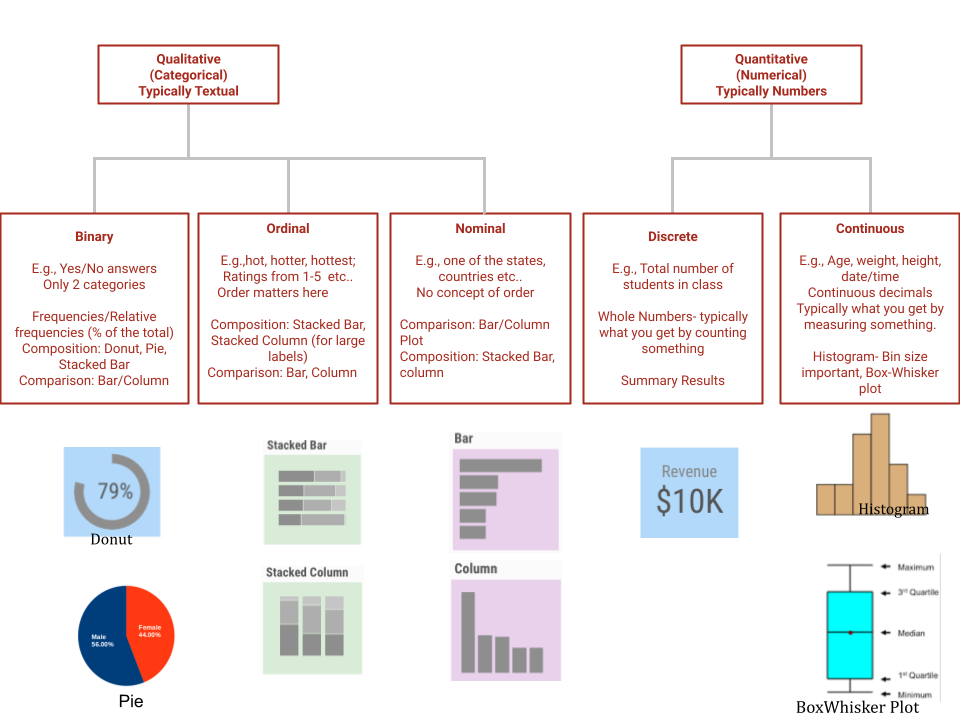
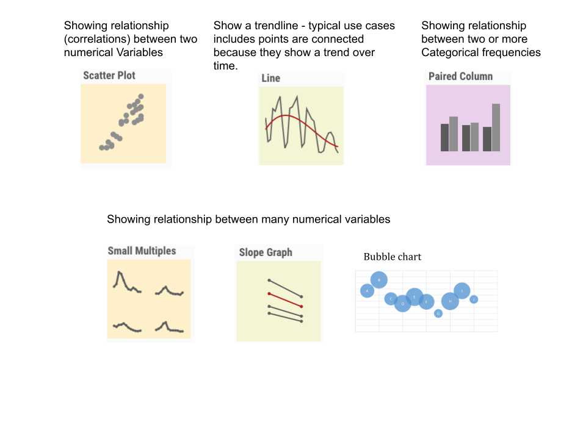

```{r setup, include=FALSE}
library(learnr)
library(tidyverse)
library(nycflights13)
```

## Today's lecture

* Learn how to perform [exploratory data analysis](https://en.wikipedia.org/wiki/Exploratory_data_analysis) (EDA) using the tidyverse and ggplot.


  
  
## John Tukey, father of EDA


<center>


“The greatest value of a picture is when it forces us to notice what we never expected to see.” — John Tukey

## What is EDA? 

Procedures for analyzing data, techniques for interpreting the results of such procedures, ways of planning the gathering of data to make its analysis easier, more precise or more accurate, and all the machinery and results of (mathematical) statistics which apply to analyzing data.

The book version:

* Generate questions about your data.
* Search for answers by visualizing, transforming, and modelling your data.
* Use what you learn to refine your questions and/or generate new questions.
(Return to #1).

Typical questions useful for making discoveries within your data:

* What type of variation occurs within my variables?
* What type of covariation occurs between my variables?

## Data Understanding

Before you start with visualization, first step is understand the data!

* Import and View Data: Load the data and examine the first few rows to understand its structure.
* Data Types and Structure: Identify data types (numerical, categorical, etc.) and check for any inconsistencies.
* Summary Statistics: Calculate basic statistics (mean, median, standard deviation, quartiles) for numerical features and frequency counts for categorical features.

## Identify Patterns & Anomalies

Look for trends, outliers, missing data patterns, and any unusual observations in visualizations and summary statistics.

## Data Cleaning

**Garbage In Garbage Out**

Visualizing data that has many anomalies, renders your analysis inaccurate! Fix the anomalies first.

**Handling Missing Values**

* Identify Missing Data: Determine the extent and study if any pattern of missingness
* Imputation (if appropriate):
  * Numerical Data: Mean/Median/Mode imputation, K-Nearest Neighbors (KNN), linear regression, etc.
  * Categorical Data: Mode imputation, KNN imputation, creating a "Missing" category.
  
**Deletion (if appropriate)**

* Row Deletion: Remove rows with missing values if the data loss is minimal and the missingness is random.
* Column Deletion: Remove entire columns with a high percentage of missing values if they are not crucial for analysis.

**Data Transformation:**

* Data Type Conversion: Convert data types to appropriate formats (e.g., string to datetime).

* Create New Columns: Mutate new columns from existing ones to potentially improve your visualization (binning for e.g.)

## Visualizing: Continuous vs. Categorical (discrete)

The appropriate visualization will depend on whether the data are:

* Continuous: they take on an infinite number of ordered values -typically numerical.
* Categorical: they take on one of a small number of values.


## What type of chart to use?

Visualization is an art. Choosing the correct chart is at the center of creating great visualization

Let's get started!



## Showing relationships




Reference:
https://guides.lib.berkeley.edu/data-visualization/type

## Choosing colors

* For continuous data, color ramps are effective.
* For discrete data, always try to limit colors (under 5 is ideal).

Too many colors makes it hard to distinguish, and also requires frequent referencing of the legend.
If you limit yourself to just a few colors, then your audience can actually remember what’s what.  Be kind to your reader!


## Let's EDA on Diamonds dataset

This is a dataset of price, quality, and other characteristics for 54k diamonds.

```{r}
diamonds |> glimpse()
```

## Data Overview
Display the first few rows of the dataset
```{r}
head(diamonds)
```

## Check the structure of the dataset
```{r}
# using 'str' function this time
str(diamonds)
```


## Summary statistics

```{r}
summary(diamonds)
```

## NA values


```{r}
sum(is.na(diamonds))        # Total NA values in the data frame
colSums(is.na(diamonds))    # alternative NA counts per column
```

No missing values in this data.

## Histogram of 'carat' - a continuous variable

```{r}
diamonds |> filter(carat < 3) |> ggplot(aes(x = carat)) +
  geom_histogram()
```

**Unusual values (outliers)**

Outliers are "unusual" observations.

* Sometimes they are due to data entry errors.
* Sometimes they are important for other reasons.

Does the above chart show outliers?

## Outlier detection
A better chart for outlier detection
```{r}
diamonds |> ggplot(aes(x = carat)) +
  geom_boxplot()
```

## Revisit histogram

How else can we view the same data that shows different information?

```{r}
diamonds |> ggplot(aes(x = carat)) +
  geom_histogram(binwidth = 0.01)
```

## Distribution of price

```{r}
ggplot(diamonds, aes(x = price)) +
  geom_histogram(binwidth = 500, fill = "steelblue", color = "black") +
  labs(title = "Distribution of Diamond Prices", x = "Price", y = "Frequency")
```

## Histrogram for all numerical values

```{r}
diamonds |>
  select(where(is.numeric)) |>
  gather() |>
  ggplot(aes(x = value, fill = key)) +
  geom_histogram(binwidth = 0.5, position = "identity", alpha = 0.7) +
  facet_wrap(~key, scales = "free") +
  labs(title = "Histograms of Numerical Variables",
       x = "Value",
       y = "Frequency",
       fill = "Variable") 
```


```{r}
diamonds |>
  select(where(is.numeric)) |>
  gather()
```


## Covariation

Covariation is the relationship between two variables where a change in one variable is associated with a change in the other.

* Height and weight
* Ice Cream Sales and Temperature
* Hours Studied and Exam Grades
* Amount of Exercise and Weight Loss

One of the best way to spot covariation is to visualize the "joint distribution" of both variables.

When studying covariation among two variables, there are three possibilities, depending on whether the variables are continuous, categorical, or a mixture.

## Continuous and categorical

With one continuous and one categorical variable, there are several choices:

* Box-and-whisker plot
* Multiple/colored histograms

Let's study covariation of _cut_ and _price_ in the diamonds data set.

```{r}
diamonds |> ggplot(aes(x = cut, y = price)) +
  geom_boxplot(fill = "lightblue", color = "black") +
  labs(title = "Price by Cut", x = "Cut", y = "Price")
```

Using **fct_reorder** for better visualiztion

```{r}
ggplot(diamonds,
       aes(x = fct_reorder(cut, price, median), y = price)) +
  geom_boxplot() +
  labs(title = "Price by Cut", x = "Cut", y = "Price")
```


## Price vs Carat with facet

```{r}
ggplot(diamonds, aes(x = carat, y = price)) +
  geom_point() +
  facet_wrap(~color)
```

## Two categorical variables

To study covariation between two categorical variables, we can count the number of observations for each combination of values:

```{r}
diamonds |> ggplot(aes(x = color, y = cut)) +
  geom_count()
```


## Colr vs Cut using a _heatmap_

Another type of plot you will see often (especially in bio) is a heat map:

```{r}
diamonds |> count(color, cut) |>
    ggplot(aes(x = color, y = cut, fill = n)) +
        geom_tile()
```

Seeing in tabular view

```{r}
diamonds |> count(color, cut) %>% print
```


## Two continuous variables
Finally, if we're studying the covariation between two continuous variables, we have several options:

* Scatter plot (geom_point)
* Binning (geom_bin2d/geom_hex)
* Contour/bivariate density (geom_density_2d)

```{r}
ggplot(diamonds, aes(x = carat, y = price)) +
  geom_bin2d()
```

##  Conditional Distribution with Violin

```{r}
diamonds |> ggplot(aes(x = cut, y = price)) + geom_violin()
```

## Two Quantitative Joint Distribution


```{r}
diamonds |> ggplot( aes(x = carat, y = price, color = cut)) +
    geom_point(alpha = 0.5) + 
    labs(title = 'Joint Distribution of Quantitative Variables',
         x = "Carat",
         y = "Price")
```

## Locally weighted least squares (loess) 

```{r}
diamonds |> ggplot( aes(x = carat, y = price)) +
    geom_point(alpha = 0.5) + stat_smooth() +
    labs(title = 'Joint Distribution with Smooth curve',
         x = "Carat",
         y = "Price")
```
Stratify by cut

```{r}
diamonds |> ggplot( aes(x = carat, y = price, color = cut)) +
    geom_point(alpha = 0.5) + stat_smooth() +
    labs(title = 'Joint Distribution with Stratification',
         x = "Carat",
         y = "Price")
```


## Multivariate Analysis
Pair plot

```{r}
diamonds |>
  select(where(is.numeric)) |>
  pairs(col = diamonds$cut)
```


## Final insights and Observations

* Price is highly skewed to the right, indicating a large number of diamonds with lower prices.
* Carat has a wide range, with some outliers on the higher end.
* There is a strong positive correlation between price and carat.
* Cut seems to have a significant impact on price, with 'Fair' cut having a higher median price.

## Further Analysis?
* You could explore more by plotting more relationships
* Build a predictive model to predict diamond prices by choosing features based on EDA

## EDA on flights data

```{r}
flights |> glimpse()
```

