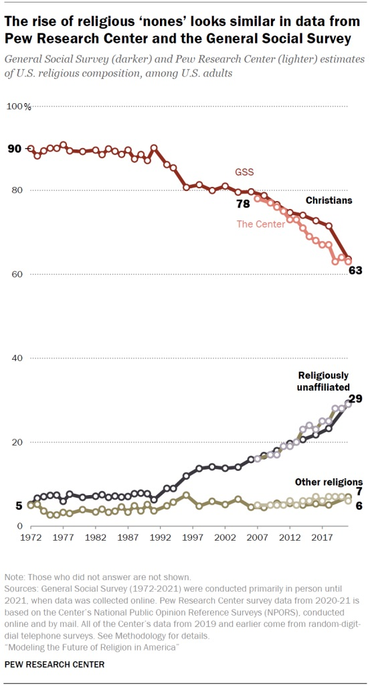
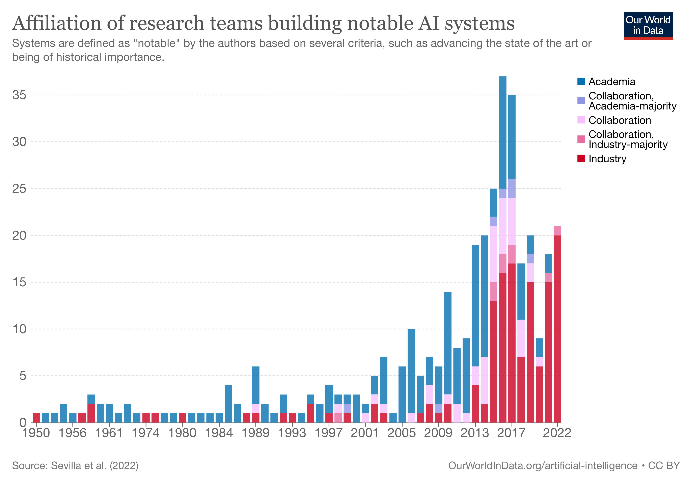
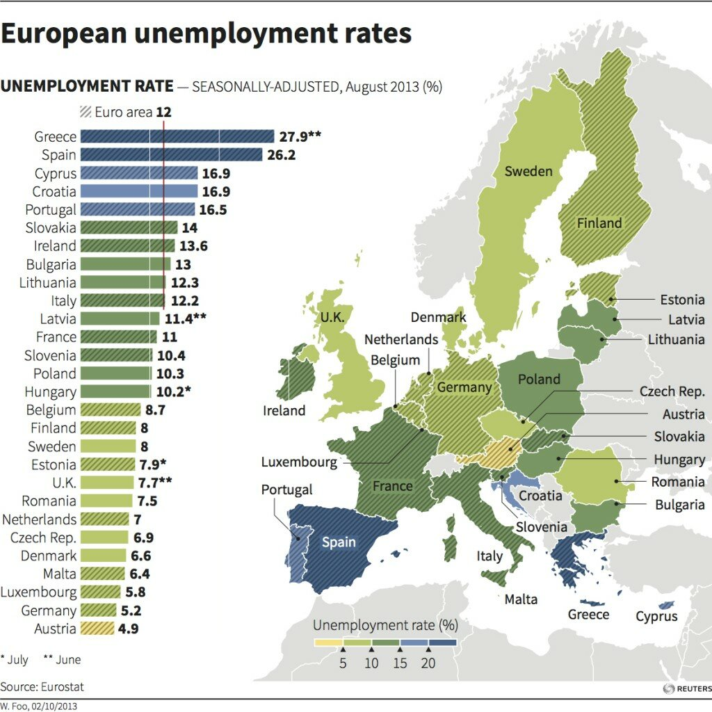
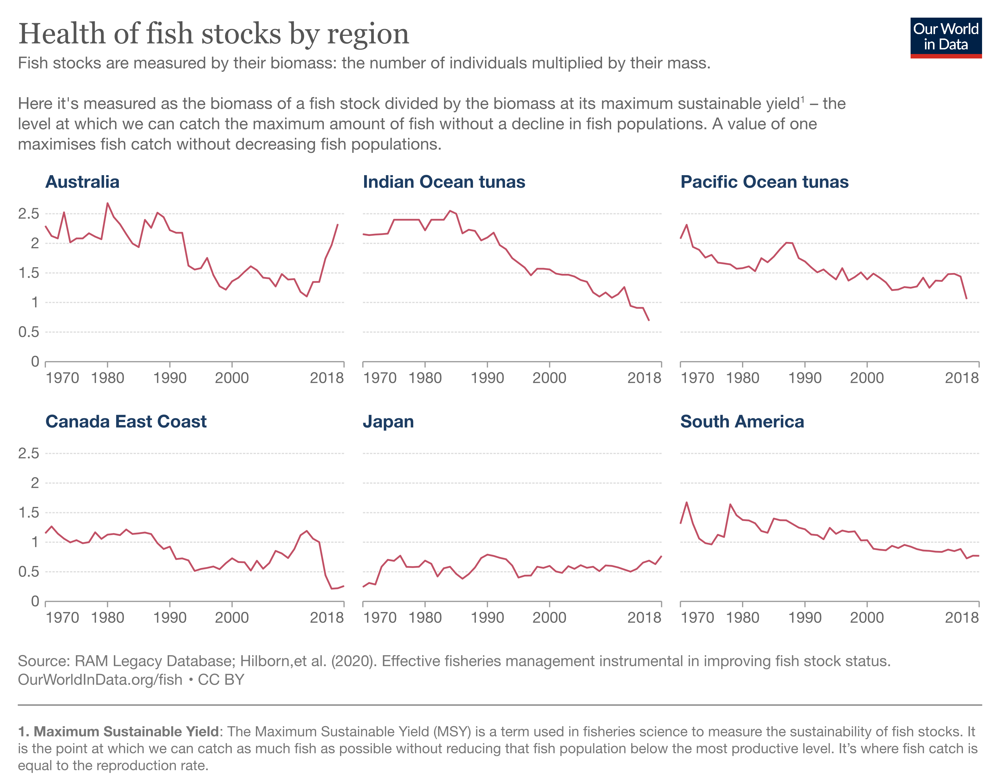
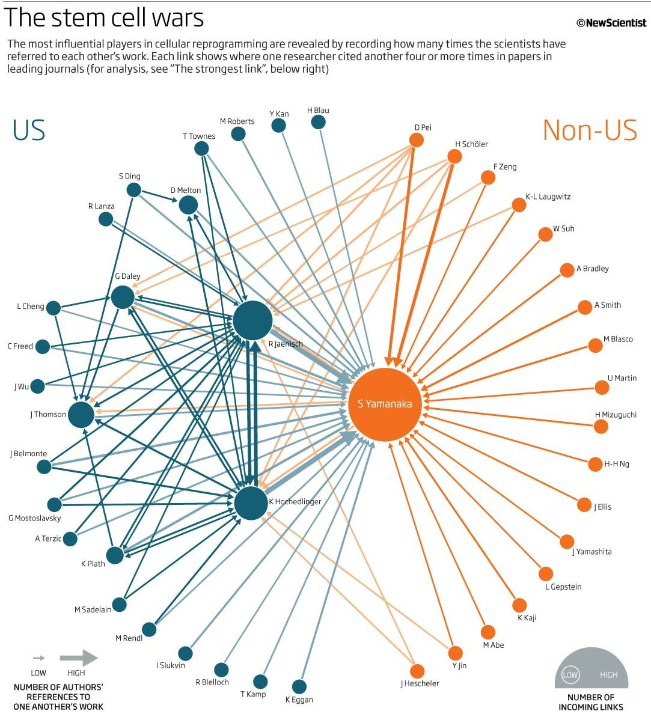

```{r setup, include=FALSE}
library(learnr)
library(tidyverse)
library(lubridate) # install.packages("lubridate") if you don't have this
library(Lahman) # install.packages("Lahman") if you don't have this
```

## from last class


```{r}
flights |> slice_sample(n = 1000) |>
     select(month, dep_delay) |>
     pairs(col = factor(flights$origin))
```


## Missing values

Missing values can be:

* Explicit (marked as NA in our data); or
* Implicit (not present in the data).

```{r}
df <- tribble(
  ~person,           ~treatment, ~response,
  "Derrick Whitmore", 1,         7,
  NA,                 2,         10,
  NA,                 3,         NA,
  "Katherine Burke",  1,         4,
  NA,  1,         NA
)
df
```

The missing values are explicit in this table: each missing value is indicated by NA in the table.

You can fill in these missing values with tidyr::fill(). It works like select(), taking a set of columns, and fills them in with the last non-missing value.

```{r}

# fill df for person and response columns
fill(df, person, response)
```

## Encoded missing data

Sometimes, data contain a concrete value that actually represents a missing value. You see this often when dealing with data that is imported from a format that does not have a way to represent missing values, such as text or CSV. So it must instead use some special value like 99 or -999.

To correct for this type of missing value, we can use a function called na_if(x, n). This takes a vector x and replaces any occurence of n with NA:

```{r}
x = c(-99, 1, 3, -99, 2)
print(x)
na_if(x, -99)
```

A second type of missing data occurs when there are simply no observations in the dataset for a particular combination of columns. For example:

```{r}
stocks <- tibble(
  year  = c(2020, 2020, 2020, 2020, 2021, 2021, 2021),
  qtr   = c(   1,    2,    3,    4,    2,    3,    4),
  price = c(1.88, 0.59, 0.35,   NA, 0.92, 0.17, 2.66)
)
print(stocks)
```

This dataset has two missing observations:
* The price in the 2020q4 is explicitly missing. (It has an NA.)
* The price in 2021q1 is implicitly missing: it does not appear in the dataset.

>* An explicit missing value is the presence of an absence.

>* An implicit missing value is the absence of a presence.

## Fixed value replacement
Sometimes missing values represent some fixed and known value, most commonly 0. You can use dplyr::coalesce() to replace them:

```{r}

x <- c(1, 4, 5, 7, NA)
coalesce(x, 100)
```

## Titanic missing value analysis
On April 15, 1912, the great "unsinkable" RMS Titanic ship sank to the bottom of the Atlantic.

Unfortunately, there weren’t enough lifeboats for everyone on board, resulting in more than 1500 deaths out of 2224 passengers and crew. Refer:https://en.wikipedia.org/wiki/Titanic

We have partial list of passengers here. Let us do some analysis

```{r}
titanic = read.csv('https://storage.googleapis.com/mbcc/titanic.csv')
titanic |> head() 
```

## Exercise
What is the average age of the passengers (ignoring the decimal part)?

```{r eg-1, exercise = TRUE}

```

```{r eg-1-solution}
titanic |>
  filter(!is.na(age)) |>
  summarize(mean_age = mean(age))

#alternatively
summary(titanic$age)
mean(titanic$age, na.rm = T)
titanic$age %>% mean(na.rm = T)
```

## Exercise
Find the number of NA values in the age column

```{r eg-2, exercise = TRUE}
```

```{r eg-2-solution}
# many ways

sum(is.na(titanic$age))
titanic %>% count(is.na(age))
titanic %>% filter(is.na(age)) %>% nrow
```

## Exercise
Replace the NA values in the age column with average age

```{r eg-3, exercise = TRUE}

```

```{r eg-3-solution}
titanic |>
  mutate(age = coalesce(age, mean(age, na.rm = T))) |>
  count(is.na(age))
```

Is there any other way you want to select the right value to impute?


## Basic rules for good plots

* Label the axes.
* Include units.
* Explain anything that is "encoded" (color scales, size variation, etc.)
* Use appropriate geometry.
* Include sources/attribution.
* Use the simplest possible design necessary to convey the information.


## Good Visualization - 1



## Good Visualization - 2



## Good Visualization - 3



## Good Visualization - 4



## Good Visualization - 5




## Bad Visualizations


Sometimes the easiest way to learn what to do is to study what not to do...

A case for a _pie_ chart is very rare!

```{r}
diamonds |> count(color) -> color_distribution
ggplot(color_distribution, aes(x = "", y = n, fill = color)) +
    geom_bar(stat = "identity", width = 1) +
    coord_polar("y") +
    theme(legend.position = "right")
```

**What's wrong:**

* Too many slices: With 7 categories, it's nearly impossible to distinguish and compare slices accurately.

**How to improve:**
Bar charts excel at comparing values across categories.

```{r}
ggplot(diamonds, aes(x = color, fill = color)) +
    geom_bar() +
    theme(legend.position = "right")
```


## Legend overload

```{r}
diamonds |> filter(carat > 2) |> ggplot(aes(x = carat, y = price, color = factor(z))) + geom_point() 
```

**What's wrong**

* Too many legends 
* The human eye struggles to interpret the non-uniform color changes, making it hard to perceive trends in the data.

**How to improve**

* Choose a palette where equal data intervals correspond to equally perceived color differences.

```{r}
diamonds |> filter(carat > 2) |> ggplot(aes(x = carat, y = price, color = z)) + geom_point() + scale_color_viridis_c()
```

## 3D Mayhem

```{r}
library(plot3D)

x <- y <- seq(-3, 3, length.out = 50)
z <- outer(x, y, function(x, y) x^2 + y^2)

persp3D(x, y, z, theta = 30, phi = 20, 
        col = ramp.col(col = c("blue", "red"), n = 50),
        ticktype = "detailed")
```

**What's wrong:**

* Distortion and occlusion: Data points at the back are hidden, and perspective distorts relationships between values.

* Difficult to read: Precisely reading values from the chart is challenging.

**How to improve:**

* Use 2D alternatives: Contour plots, heatmaps, or multiple line charts can often represent the same data more effectively.

```{r}
filled.contour(x, y, z, color.palette = terrain.colors)
```

## Distorted message

This chart misrepresents inflation by using a truncated y-axis, which dramatically exaggerates the perceived changes over time.

```{r}
data = tibble(Year = c(2021:2024), Value = c(5.51, 6.65, 4.38, 4.56))
ggplot(data, aes(x = factor(Year), y = Value)) + 
    geom_bar(stat = "identity", fill = "steelblue") +
    labs(x = "Year", y = "Inflation rate", title = "Inflation in the recent years") +
    theme_minimal() + coord_cartesian(ylim = c(4.4, 6))
```

It may also be better to show the trend with a line instead of a bar

**Improved version**

```{r}
ggplot(data, aes(x = Year, y = Value)) + 
    geom_line() +
    labs(x = "Year", y = "Inflation rate", title = "Inflation rate in the recent years") + coord_cartesian(ylim = c(0,7))
```

## Comparison that is hard!

This chart shows the increase in users over three years. However, how easy is to compare the length of chunks for each company acorss the three years?

```{r}
data <- data.frame(
    Year = rep(c(2021, 2022, 2023), each = 3),
    Platform = rep(c("Google", "Facebook", "Twitter"), 3),
    Users = c(250, 200, 150, 
              260, 240, 170,
              310, 260, 200) # Fictitious user numbers (in millions)
)

# Generate the stacked bar chart
ggplot(data, aes(x = factor(Year), y = Users, fill = Platform)) +
    geom_bar(stat = "identity") +
    labs(title = "User Increase Across Platforms (2021-2023)",
         x = "Year",
         y = "Number of Users (Millions)") +
    theme_minimal() 
```

**Improved version**

```{r}
ggplot(data, aes(x = Year, y = Users, color = Platform)) +
    geom_line() +
    labs(title = "User Increase Across Platforms (2021-2023)",
         x = "Year",
         y = "Number of Users (Millions)") +
    theme_minimal() + scale_x_continuous(breaks = c(2021:2023))
```

## Yet another colorful chart but...

```{r}
product <- c(rep("Product A", 3), rep("Product B", 3), rep("Product C", 3))
year <- rep(c(2021, 2022, 2023), 3)
sales <- c(120, 120, 180, 90, 120, 130, 70, 95, 120)

df <- tibble(product, year, sales)

ggplot(df, aes(x = factor(year), y = sales, fill = product)) +
    geom_bar(stat = "identity", position = "dodge") +
    labs(title = "Product Sales Over Three Years",
         x = "Year",
         y = "Sales") +
    theme_minimal()
```

**Improved version**

```{r}
ggplot(df, aes(x = year, y = sales, color = product)) +
    geom_line() +
    labs(title = "Product Sales Over Three Years",
         x = "Year",
         y = "Sales") +
    theme_minimal() + scale_x_continuous(breaks = c(2021:2023))
```


## You will find bad visualizations a lot!

[Reference](https://www.tumblr.com/badvisualisations)
