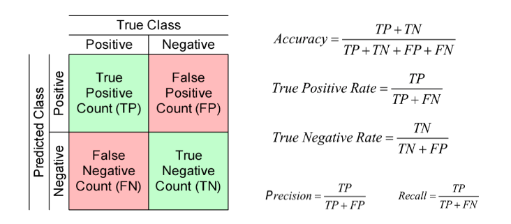

```{r setup, include=FALSE}
knitr::opts_chunk$set(echo = TRUE)
library(learnr)
library(tidyverse)
library(modelr)

data(Titanic)
titanic_df <- Titanic %>% as_tibble %>% mutate(Survived = Survived == "Yes") 
```

## Recap

We used the titanic data and our challenge here is to predict if the passenger survives the tragedy or not (yes or no).

```{r}
titanic_df |> head()

# get the necessary rows 
titanic_df <- titanic_df[rep(row.names(titanic_df), titanic_df$n), -5]

titanic_df |> head()
```

## glm


We used: glm(). (The "g" stands for generalized linear model.) for logistic regression. And the only one feature we use is Sex

```{r}
mdl <- glm(Survived ~ Sex, data = titanic_df, family = "binomial")
#                                             ^^^^^^ important
mdl
```

## Predictions

```{r}
titanic_df |> add_predictions(mdl) 
```


What is the mean value of male and female passengers?

```{r}
titanic_df |> add_predictions(mdl)  |> group_by(Sex) |> summarize(mean = mean(pred))
```
## log-odds

Although these results look similar to linear regression, their interpretation is quite different. Specifically, they are interpreted in terms of their effect on the *log-odds* ratio.

The model we estimated above is

$$\log \left( \frac{p}{1-p} \right) = a_0 + a_1 \cdot \{\text{Male}\}$$

where $p$ is now the probability that a passenger survived.

Let's confirm this by calculating the percentage of male passengers that survived:

```{r}
titanic_df %>% count(Sex, Survived)
```

```{r}

367 / (1364 + 367)

344 / (126 + 344)
```

The odds of survival by gender were:

```{r}

odds <- c(male = .212 / .788, female = .7319149 / .2680851)
log(odds)
```

```{r}
coef(mdl)[[1]]
```

Let us confirm the predictions are indeed the log-odds ratio

```{r}
titanic_df %>% add_predictions(mdl) %>% count(pred)
```

## Logistic function

The logistic function is $\sigma(x) = 1 / (1 + e^{-x})$. It is the inverse of the log-odds function:
$$\sigma \left( \log \frac{p}{1-p} \right) = p$$

So, to calculate predicted probabilities from the log-odds, we apply the $\sigma(x)$ function to the predicted log-odds:

```{r}
sigma <- function(x) 1 / (1 + exp(-x))
sigma(coef(mdl)[[1]])  # probability of survival for females
sigma(sum(coef(mdl)))  # probability of survival for males
```

```{r}
sigma(log(0.21/(1-0.21)))
```

## Continuous predictor
Now let's consider logistic regression using a continuous predictor. To do this we'll download a richer version of this dataset which includes *age* as a number, instead of just classifying each passenger as adult or child:

```{r}
titanic_df2 <- read_csv('https://raw.githubusercontent.com/datasciencedojo/datasets/master/titanic.csv')
titanic_df2 %>% print
```

## glm

```{r}

mdl <- glm(Survived ~ Age, data = titanic_df2, family = "binomial")
summary(mdl)
```

Now our regression model is

$$\log \left( \frac{p}{1-p} \right) = a_0 + a_1 \cdot \text{Age}.$$


## Logistic regression with multiple predictors
Just like with linear regression, multiple predictors can be added to logistic regression. The predicted log-odds become a multilinear function of the predictors:

$$\log \left( \frac{p}{1-p} \right) = a_0 + a_1 x_1 + \cdots + a_k x_k$$

```{r}
mdl <- glm(Survived ~ Class + Age + Sex, data = titanic_df, family = "binomial")
#                                                           ^^^^^^ important! 
summary(mdl)
```

The model we are fitting here is:

$$\underbrace{ \log\left( \frac{p_\text{survival}}{1-p_\text{survival}}  \right)}_\text{log odds ratio} = 2.04-1.02\times\texttt{\{2nd class\}}+\cdots-2.42\times \texttt{male}$$

To be clear, the "model" for how the above data was generated is the following:

First, I use all the predictors to form the log-odds ratio. For example, for an adult, male, third-class passenger, the predicted log-odds ratio is:

```{r}

titanic_df %>% add_predictions(mdl) %>% 
    filter(Class == "3rd", Sex == "Male", Age == "Adult") %>% head
```

The log-odds ratio is -2.153985. The predicted probability of survival is obtained by solving


$$\log\left(\frac{p}{1-p}\right) = -2.153985$$

for $p$

To do this we apply the logistic function $f(x)=1/(1+e^{-x})$

$$p = \frac{1}{1 + \exp(2.153985)} = .104$$

```{r}
-2.15 %>% sigma
```

## Confusion Matrix

{#id .class width=70%}

* True positive rate (tpr, a.k.a recall or sensitivity): The percentage of people who are predicted to survive who in fact survived.
In addition to above we'll also add 1 more measure:

* False positive rate (fpr): The percentage of people who are predicted to survive who in fact perished.
Note: True negative rate is also called specificity. Therefore False positive rate (fpr) is 1 - specificity

```{r}

titanic_pred <- titanic_df %>% 
  add_predictions(mdl, type = "response") %>% 
    print
```

Note: adding `type = 'response'` computes the probability instead of the log-odds ratio


Let us add a categorical output column:

```{r}

titanic_pred %>% mutate(Survived_hat = as.integer(pred > 1/2)) %>% head

titanic_pred %>% mutate(
    Survived_hat = pred > .4,
    Perished = !Survived, 
    Perished_hat = !Survived_hat,
    tn = Perished_hat & Perished,  # true -
    tp = Survived & Survived_hat,  # true +
    fp = Survived_hat & Perished,  # false +
    fn = Perished_hat & Survived   # false -
) %>% summarize(
    fpr = sum(fp) / (sum(fp) + sum(tn)),  # fraction of true - incorrectly classified as +,
    tpr = sum(tp) / (sum(tp) + sum(fn))  # fraction of true + correctly classified as +
)
```

## Choosing threshold


When we choose an extreme high value of the threshold, our classification rule always predicts:

* `Survival = 0`, so it has a false-positive rate of zero. This is good; we want our classifier to make as few false-positive predictions as possible.

* However, it also has a true positive rate of zero! So it has no power to correctly predict that any of the true survivors in fact survived.
* Conversely, when we choose an extremely low value, it always predicts survival, so TPR = FPR = 1.

In other words, there is a tradeoff between having a good (i.e. close to zero) false-positive rate and a good (i.e. close to 1) true positive rate.


## Building a good model

In a earlier lecture, we saw how to create large, rich regression models by including more and more predictors in our regression. But we also saw that this could actually decrease predictive accuracy when analyzing data that the model had never seen before.

Now, we will learn ways to systematically build a good model by dividing our data and using out-of-sample predictive performance to guide model selection.

The first step will be to divide our data into two sets, training and test.

* We will use the training set to train our model, and then
* The testing set will be used to judge how accurate it is on new data.

```{r}
library(caTools)


# Split the dataset into training and test sets (70% train, 30% test)
set.seed(123) # For reproducibility
split <- sample.split(titanic_df$Survived, SplitRatio = 0.7)
train_data <- filter(titanic_df, split == TRUE)
test_data <- filter(titanic_df, split == FALSE)

# Perform logistic regression on the training data
log_model <- glm(Survived ~ ., data = train_data, family = binomial)

# Make predictions on the test set
test_data$predicted <- predict(log_model, newdata = test_data, type = "response")


# You can also calculate accuracy
accuracy <- mean(ifelse(test_data$Survived == 1 & test_data$predicted >= 0.5 |
                          test_data$Survived == 0 & test_data$predicted < 0.5, 1, 0))
cat("Accuracy:", accuracy * 100, "%\n")
```


